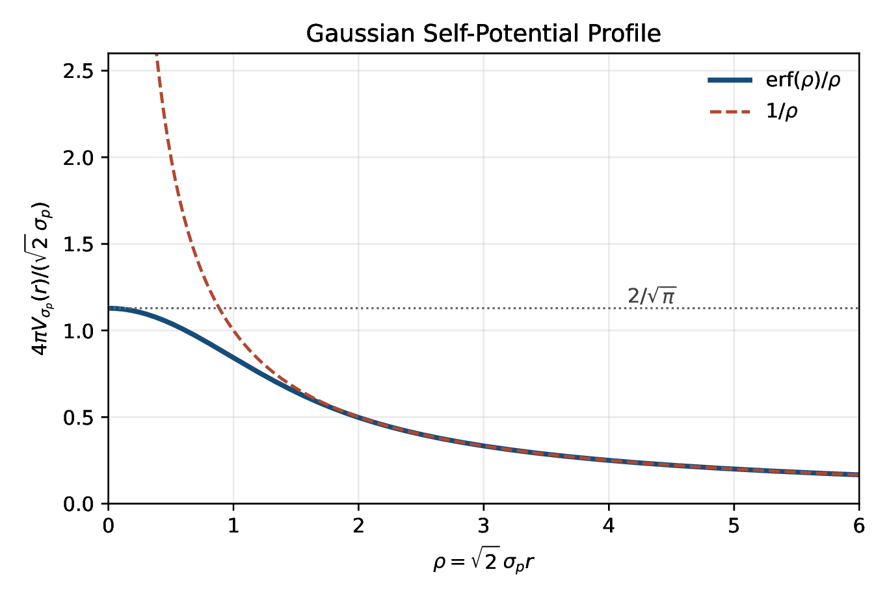

# Orientation

## One-Hour Map

::: {.timing}
::: {.time}
0-5 min
:::
::: {}
What "force" means in a field theory.
:::
::: {.time}
5-15 min
:::
::: {}
Scalar QED as the clean toy model.
:::
::: {.time}
15-28 min
:::
::: {}
One Gaussian packet and its smoothed Coulomb self-field.
:::
::: {.time}
28-43 min
:::
::: {}
Two packets: charge sign, potential energy, attraction vs repulsion.
:::
::: {.time}
43-55 min
:::
::: {}
Eikonal phase, transverse kick, and numerical animations.
:::
::: {.time}
55-60 min
:::
::: {}
Summary and questions.
:::
:::

::: {.notes}
Use this as a one-hour blackboard-and-slides lecture. The formulas are the
spine; the animations are the payoff.
:::

## Guiding Question

::: {.question}
In QFT, where exactly do attraction and repulsion live?
:::

::: incremental
- Not primarily in a Newtonian force law.
- Not only in a static potential.
- In the phase and field configuration of a quantum state.
- In a wave-packet language: in the accumulated phase gradient and the resulting momentum transfer.
:::

$$
\nabla_\perp \Theta
\quad\Longrightarrow\quad
\Delta \mathbf p_\perp
$$

## Working Definition

For this lecture we call an interaction:

::: incremental
- **repulsive** if the transverse momentum transfer increases packet separation;
- **attractive** if it bends the packet centers toward each other;
- **field-theoretic** if the effect follows from the coupled scalar and electromagnetic fields.
:::

::: {.takeaway}
The sign of the charge product decides the direction; the finite wave-packet size decides how singular the answer is.
:::

## Why Scalar QED?

::: {.compact}
- The scalar field removes spin from the story.
- The electromagnetic field keeps the familiar long-range interaction.
- Gaussian packets make the link to trajectories and animations transparent.
- The model is still a genuine local relativistic field theory.
:::

$$
\text{scalar wave packet}
\quad+\quad
\text{dynamical } A_\mu
\quad\Rightarrow\quad
\text{attraction or repulsion}
$$

::: {.notes}
Stress that this is a toy model for concepts, not a replacement for full QED
with spinor matter.
:::

# Scalar QED

## The Lagrangian

The scalar QED Lagrangian is

$$
\mathcal L
=
(D_\mu \varphi)^*(D^\mu \varphi)
-m^2\varphi^*\varphi
-\frac{1}{4}F_{\mu\nu}F^{\mu\nu},
$$

$$
D_\mu=\partial_\mu+iqA_\mu,
\qquad
F_{\mu\nu}=\partial_\mu A_\nu-\partial_\nu A_\mu.
$$

::: {.fragment}
The sign of the charge enters through the covariant derivative, not by adding a separate force by hand.
:::

## Equations of Motion

In Lorenz gauge,

$$
\partial_\mu A^\mu=0,
$$

the equations become

$$
\begin{aligned}
(\partial^2+m^2)\varphi
&=
q^2A^2\varphi
-2iqA_\mu\partial^\mu\varphi,
\\
\partial^2 A^\mu
&=
iq(\varphi^*\partial^\mu\varphi-\varphi\partial^\mu\varphi^*)
-2q^2A^\mu|\varphi|^2 .
\end{aligned}
$$

::: {.notes}
The first equation says that the electromagnetic potential shifts the scalar
wave. The second says that the scalar wave itself sources the electromagnetic
field.
:::

## Weak-Coupling Bookkeeping

Use the perturbative expansion

$$
\varphi
=
\varphi^{(0)}
+q^2\varphi^{(2)}
+O(q^4),
\qquad
A_\mu
=
qA_\mu^{(1)}
+q^3A_\mu^{(3)}
+O(q^5).
$$

Then

$$
(\partial^2+m^2)\varphi^{(0)}=0,
\qquad
\partial^2 A_\mu^{(1)}=J_\mu,
$$

with

$$
J_\mu
=
i\left(
\varphi^{(0)*}\partial_\mu\varphi^{(0)}
-\varphi^{(0)}\partial_\mu\varphi^{(0)*}
\right).
$$

## What We Need From the Expansion

::: {.compact}
- First: a free packet \(\varphi^{(0)}\).
- Second: the electromagnetic field \(A_\mu^{(1)}\) generated by that packet.
- Third: the \(O(q^2)\) phase correction to the packet.
- Finally: two packets and the sign of the mutual term.
:::

$$
\varphi^{(0)}
\longrightarrow
J^\mu
\longrightarrow
A^{(1)\mu}
\longrightarrow
\varphi^{(2)}
\longrightarrow
\Theta,\ \Delta \mathbf p_\perp
$$

# One Gaussian Packet

## Narrow Momentum Packet

In the packet rest frame, take

$$
\widetilde\psi(\mathbf k)
=
(2\pi)^{3/4}\sigma_p^{-3/2}
\exp\!\left[-\frac{\mathbf k^2}{4\sigma_p^2}\right],
\qquad
\sigma_p\ll m .
$$

The exact free solution is

$$
\varphi_{\rm rest}^{(0)}(x)
=
\int\frac{d^3k}{(2\pi)^3}
\widetilde\psi(\mathbf k)
e^{i\mathbf k\cdot\mathbf x-iE_{\mathbf k}t},
\qquad
E_{\mathbf k}=\sqrt{m^2+\mathbf k^2}.
$$

## Coordinate-Space Form

Using

$$
E_{\mathbf k}
=m+\frac{\mathbf k^2}{2m}
+O\!\left(\frac{\sigma_p^4}{m^3}\right),
$$

the packet is approximately

$$
\varphi_{\rm rest}^{(0)}(x)
\approx
\left(\frac{2\sigma_p^2}{\pi}\right)^{3/4}
\frac{1}{(1+i\tau)^{3/2}}
\exp\!\left[-\frac{\sigma_p^2\mathbf x^2}{1+i\tau}\right]
e^{-imt},
$$

$$
\tau=\frac{2\sigma_p^2t}{m},
\qquad
t_{\rm disp}=\frac{m}{2\sigma_p^2}.
$$

## Density and Current

Define

$$
s_p(t)=\frac{\sigma_p}{\sqrt{1+\tau^2}},
\qquad
\sigma_x(t)=\frac{1}{2s_p(t)}.
$$

Then

$$
n(t,\mathbf x)=|\varphi_{\rm rest}^{(0)}(x)|^2
=
\left(\frac{2s_p^2(t)}{\pi}\right)^{3/2}
\exp[-2s_p^2(t)\mathbf x^2].
$$

To leading order in \(\sigma_p/m\),

$$
J^\mu(t,\mathbf x)
\approx
\left(
2mn(t,\mathbf x),
\;
4\frac{\sigma_p^2\tau}{1+\tau^2}\mathbf x\,n(t,\mathbf x)
\right).
$$

## The Self-Field Is Almost Electrostatic

The spatial current is suppressed by \(\sigma_p/m\), so

$$
A_{\rm rest}^{(1)i}=O\!\left(\frac{\sigma_p}{m}\right),
\qquad
-\Delta A_{\rm rest}^{(1)0}(t,\mathbf x)\approx J^0(t,\mathbf x).
$$

Thus

$$
A_{\rm rest}^{(1)0}(t,\mathbf x)
\approx
2m\int d^3y\,
\frac{n(t,\mathbf y)}{4\pi|\mathbf x-\mathbf y|}.
$$

::: {.takeaway}
A finite packet replaces the point Coulomb source by a smooth charge cloud.
:::

## Smoothed Coulomb Kernel

For a Gaussian packet,

$$
\boxed{
A_{\rm rest}^{(1)0}(t,r)
\approx
\frac{m}{2\pi r}
\operatorname{erf}\!\left(\sqrt{2}\,s_p(t)r\right)
}
$$

or

$$
A_{\rm rest}^{(1)0}(t,r)
\approx
2mV_{s_p(t)}(r),
\qquad
V_s(r)=
\frac{1}{4\pi r}
\operatorname{erf}\!\left(\sqrt{2}sr\right).
$$

::: {.fragment}
At large distance this is Coulomb. At the center it is finite.
:::

## Profile of the Kernel

{width="72%" .slide-image-center fig-alt="Gaussian self-potential profile compared with the Coulomb limit"}

::: {.media-caption}
Dimensionless profile \(4\pi V_s(r)/(\sqrt{2}s)\) as a function of
\(\rho=\sqrt{2}sr\). The dashed curve is the point Coulomb limit \(1/\rho\).
:::

## Boosted Packet Field

For a moving packet with mean four-momentum \(p_0^\mu=(E_0,\mathbf p_0)\),

$$
\mathbf v_0=\frac{\mathbf p_0}{E_0},
\qquad
\gamma_0=\frac{E_0}{m},
\qquad
\mathbf R=\mathbf x-\mathbf v_0t,
$$

$$
t_*=\gamma_0(t-\mathbf v_0\cdot\mathbf x)=\frac{p_0\cdot x}{m},
$$

$$
r_*^2
=
|\mathbf R|^2+
(\gamma_0^2-1)(\hat{\mathbf v}_0\cdot\mathbf R)^2.
$$

Then

$$
\boxed{
A^{(1)\mu}(x)
\approx
2p_0^\mu V_{s_p(t_*)}(r_*)
}.
$$

## Self-Phase

The \(O(q^2)\) scalar correction obeys

$$
(\partial^2+m^2)\varphi^{(2)}
=
-2iA_\mu^{(1)}\partial^\mu\varphi^{(0)}.
$$

For a narrow packet,

$$
\varphi^{(2)}(x)
=
-2im\,\mathcal I_{\sigma_p}(t_*,r_*)\,
\varphi^{(0)}(x),
$$

where

$$
\mathcal I_{\sigma_p}(t,r)
=
\int_0^t d\lambda\,V_{s_p(\lambda)}(r).
$$

## Phase Interpretation

To this order,

$$
\varphi(x)
\approx
\varphi^{(0)}(x)
\exp\!\left[-2iq^2m\,\mathcal I_{\sigma_p}(t_*,r_*)\right].
$$

In the packet rest frame this is

$$
\varphi_{\rm rest}(x)
\approx
\varphi_{\rm rest}^{(0)}(x)
\exp\!\left[-i\int_0^t d\lambda\,U_{\rm eff}(\lambda,r)\right],
$$

$$
\boxed{
U_{\rm eff}(t,r)
=
2q^2m\,V_{s_p(t)}(r)
}.
$$

::: {.takeaway}
At this level, the self-interaction is primarily a local phase shift.
:::

# Two Packets

## Two Separated Wave Packets

Let

$$
\varphi^{(0)}(x)
=
c_1\Phi_1^{(0)}(x)
+c_2\Phi_2^{(0)}(x),
\qquad
(\partial^2+m^2)\Phi_a^{(0)}=0.
$$

The sign variable

$$
\eta_a=\pm1
$$

labels the particle or antiparticle branch:

$$
\eta_a=+1 \quad\text{particle},
\qquad
\eta_a=-1 \quad\text{antiparticle}.
$$

::: {.notes}
This is the first place where attraction and repulsion can enter through a
relative sign, not through a new dynamical assumption.
:::

## Geometry of the Encounter

Each packet has a center

$$
\mathbf X_a(t)=\mathbf b_a+\mathbf v_at,
\qquad
\mathbf v_a=\frac{\mathbf p_a}{E_a},
\qquad
\gamma_a=\frac{E_a}{m}.
$$

Choose the impact parameter by

$$
\mathbf b_1=-\frac{\mathbf b}{2},
\qquad
\mathbf b_2=+\frac{\mathbf b}{2},
\qquad
\mathbf b\cdot(\mathbf v_1-\mathbf v_2)=0.
$$

Then

$$
d_{12}^2(t)
=
|\mathbf X_1(t)-\mathbf X_2(t)|^2
=
b^2+|\mathbf v_1-\mathbf v_2|^2t^2.
$$

## Nonoverlap Condition

The packet density is

$$
n_a(x)
=
\left(\frac{2s_a^2(x)}{\pi}\right)^{3/2}
\exp[-2s_a^2(x)r_{a*}^2(x)].
$$

For separated packets,

$$
b\gg\sigma_{x1}(t)+\sigma_{x2}(t).
$$

Then interference terms are suppressed as

$$
\exp\!\left[
-\frac{d_{12}^2(t)}
{4(\sigma_{x1}^2(t)+\sigma_{x2}^2(t))}
\right].
$$

::: {.takeaway}
This is the regime where talking about two packet centers is meaningful.
:::

## Charge of a Packet

Define the physical charge of packet \(a\) by

$$
Q_a=q\int_{\Omega_a(t)}d^3x\,J^0(x).
$$

For a separated narrow packet,

$$
Q_a
=
2\eta_amq\,|c_a|^2.
$$

Therefore

$$
|Q_a|=2mq|c_a|^2,
\qquad
\eta_a=\operatorname{sgn}Q_a.
$$

::: {.fragment}
Particle versus antiparticle is now the sign of the packet charge.
:::

## Field of Two Packets

The current splits:

$$
J^\mu(x)\approx J_1^\mu(x)+J_2^\mu(x),
\qquad
J_a^\mu(x)
\approx
2\eta_a|c_a|^2p_a^\mu n_a(x).
$$

The electromagnetic field coefficient also splits:

$$
A_\mu^{(1)}(x)
\approx
A_{1\mu}^{(1)}(x)+A_{2\mu}^{(1)}(x),
$$

$$
\boxed{
A_{a\mu}^{(1)}(x)
=
\frac{Q_a}{mq}\,
p_{a\mu}
V_{s_a(x)}(r_{a*}(x))
}.
$$

## Mutual Potential Energy

In the leading quasistatic approximation,

$$
\boxed{
U_{12}(t)
=
\int d^3x\,d^3y\,
\frac{\rho_1(t,\mathbf x)\rho_2(t,\mathbf y)}
{4\pi|\mathbf x-\mathbf y|}
}.
$$

If both charge clouds are spherical Gaussians,

$$
U_{12}(t)
=
Q_1Q_2\,V_{s_{12}(t)}(d_{12}(t)),
$$

$$
s_{12}(t)
=
\frac{s_1(t)s_2(t)}
{\sqrt{s_1^2(t)+s_2^2(t)}}.
$$

## The Sign Is the Physics

At large separation,

$$
U_{12}(t)
\sim
\frac{Q_1Q_2}{4\pi d_{12}(t)}.
$$

At zero separation of the centers,

$$
U_{12}(t)\big|_{d_{12}=0}
=
\frac{Q_1Q_2s_{12}(t)}
{\sqrt{2}\pi^{3/2}}.
$$

::: incremental
- \(Q_1Q_2>0\): positive energy decreases when packets separate.
- \(Q_1Q_2<0\): negative energy decreases when packets approach.
- The Gaussian width removes the point singularity.
:::

## One Formula for Both Cases

::: {.question}
What changes between attraction and repulsion?
:::

Only the sign of one packet charge:

$$
Q_a\longrightarrow -Q_a,
\qquad
\eta_a\longrightarrow -\eta_a.
$$

The kernel \(V_s(r)\), the transport equation, and the eikonal construction are the same.

::: {.takeaway}
In scalar QED, attraction and repulsion are not two mechanisms. They are two signs of the same field-theoretic mechanism.
:::

# Eikonal Form

## Phase Ansatz

For each packet write

$$
\varphi_a(x)
\approx
\varphi_a^{(0)}(x)
\exp[-i\eta_aq^2\Theta_a(x)].
$$

Linearizing,

$$
\varphi_a^{(2)}(x)
=
-i\eta_a\Theta_a(x)\varphi_a^{(0)}(x).
$$

The eikonal phase obeys

$$
\boxed{
p_a^\mu\partial_\mu\Theta_a(x)
=
\sum_{b=1}^2
\frac{Q_b}{mq}
(p_a\cdot p_b)
V_{s_b(x)}(r_{b*}(x))
}.
$$

## Self and Mutual Parts

Split

$$
\Theta_a(x)
=
\Theta_a^{\rm self}(x)
+\Theta_a^{\rm int}(x).
$$

::: {.compact}
- \(\Theta_a^{\rm self}\): phase from the packet's own smooth Coulomb field.
- \(\Theta_a^{\rm int}\): phase accumulated in the field of the other packet.
- The center deflection comes from the mutual part.
:::

For packet \(a\), with \(b\neq a\),

$$
\Theta_a^{\rm int}(t)
\propto
\int_{-\infty}^t dt'\,
V_{s_b(t')}(r_{b*}(t',\mathbf X_a(t'))).
$$

## Transverse Kick

The leading transverse momentum transfer is

$$
\boxed{
\Delta\mathbf p_{a\perp}(b)
=
-q^2\nabla_\perp
\Theta_a^{\rm int}(+\infty,b)
}.
$$

With

$$
\Pi_{a\perp}
=
\mathbf 1-\hat{\mathbf e}_a\hat{\mathbf e}_a^{\mathsf T},
\qquad
\hat{\mathbf e}_a=\frac{\mathbf p_a}{|\mathbf p_a|},
$$

the corrected center trajectory is

$$
\boxed{
\mathbf X_a^{\rm eik}(t)
=
\mathbf X_a^{(0)}(t)
-\frac{q^2}{E_a}
\int_{t_0}^{t}dt'\,
\Pi_{a\perp}\nabla\Theta_a^{\rm int}
(t',\mathbf X_a^{(0)}(t'))
+O(q^4)
}.
$$

## Center-of-Mass Kinematics

For a symmetric collision,

$$
\mathbf v_1=v\hat{\mathbf z},
\qquad
\mathbf v_2=-v\hat{\mathbf z},
\qquad
\mathbf b=b\hat{\mathbf x},
\qquad
E_1=E_2=\gamma m.
$$

Along the opposite packet center,

$$
r_{2*}(t,\mathbf X_1(t))
=
r_{1*}(t,\mathbf X_2(t))
=
\sqrt{b^2+4\gamma^2v^2t^2}.
$$

This is the geometry behind the two animations.

# Animations

## What the Code Shows

On a two-dimensional slice,

$$
A_a^{(1)0}(t,x,y)=\varkappa_aE_aV_a(t,x,y),
$$

$$
A_a^{(1)x}(t,x,y)=\varkappa_ap_{ax}V_a(t,x,y),
\qquad
A_a^{(1)y}(t,x,y)=\varkappa_ap_{ay}V_a(t,x,y),
$$

where

$$
\varkappa_a=\frac{Q_a}{mq},
\qquad
V_a(t,x,y)=V_{s_a(t,x,y)}(r_{a*}(t,x,y)).
$$

The displayed fields are reconstructed after the eikonal correction to the centers.

## Like Charges: Repulsion

```{=html}
<video class="scalar-qed-video" data-autoplay loop muted playsinline controls>
  <source src="media/scalar-qed-attraction-repulsion/pp.mp4" type="video/mp4">
</video>
```

::: {.media-caption}
Particle-particle configuration. The signs of \(Q_1\) and \(Q_2\) are the same, so \(Q_1Q_2>0\).
:::

::: {.notes}
Suggested narration: watch the centers bend away from each other; the field does
not need a point-charge singularity to produce repulsion.
:::

## Opposite Charges: Attraction

```{=html}
<video class="scalar-qed-video" data-autoplay loop muted playsinline controls>
  <source src="media/scalar-qed-attraction-repulsion/pm.mp4" type="video/mp4">
</video>
```

::: {.media-caption}
Particle-antiparticle configuration. The signs are opposite, so \(Q_1Q_2<0\).
:::

::: {.notes}
Suggested narration: the code and formulas are the same as before; only one
charge sign is changed.
:::

## Reading the Animations

::: {.compact}
- The scalar density tracks where the wave packets are.
- \(A^{(1)0}\) tracks the smooth Coulomb-like field sourced by them.
- The phase \(\Theta_a^{\rm int}\) is integrated along almost straight paths.
- The trajectory correction is then computed from \(-\nabla_\perp\Theta_a^{\rm int}\).
:::

$$
\text{field}
\longrightarrow
\text{phase}
\longrightarrow
\text{phase gradient}
\longrightarrow
\text{deflected centers}.
$$

# Conceptual Payoff

## What Became of the Force?

In this formulation, the familiar force law is a derived approximation:

$$
\Delta\mathbf p_\perp
=
-q^2\nabla_\perp\Theta^{\rm int}.
$$

::: incremental
- The field equation produces \(A_\mu\).
- The scalar equation converts \(A_\mu\) into a phase.
- The phase gradient gives the momentum transfer.
- The sign of \(Q_1Q_2\) determines the direction.
:::

## Why the Point Singularity Disappears

The packet profile replaces

$$
\frac{1}{4\pi r}
$$

by

$$
V_s(r)=
\frac{1}{4\pi r}
\operatorname{erf}(\sqrt{2}sr).
$$

At the origin,

$$
V_s(0)=\frac{s}{\sqrt{2}\pi^{3/2}},
$$

while for \(r\gg s^{-1}\),

$$
V_s(r)\sim \frac{1}{4\pi r}.
$$

::: {.takeaway}
The finite wave packet is a physical short-distance smearing, not a screening of the long-range tail.
:::

## What This Is Not

::: {.compact}
- It is not a claim that UV renormalization disappears from local QFT.
- It is not a point-particle derivation with a cutoff inserted afterward.
- It is not yet full spinor QED.
- It is a controlled wave-packet observable in scalar QED.
:::

::: {.question}
The useful lesson: singular point-particle intuition can be too sharp for the actual external states used in scattering.
:::

## One-Slide Summary

::: incremental
- Scalar QED gives a clean field-theoretic model of attraction and repulsion.
- A narrow Gaussian packet sources a smoothed Coulomb field.
- The \(O(q^2)\) effect on the scalar wave is an eikonal phase.
- Two packets interact through the mutual part of that phase.
- \(Q_1Q_2>0\) gives repulsion; \(Q_1Q_2<0\) gives attraction.
- The same equations produce both animations.
:::

$$
Q_1Q_2
\begin{cases}
>0 & \text{repulsion},\\
<0 & \text{attraction}.
\end{cases}
$$

# Backup

## External Static Potential

For Rutherford-type scattering, introduce a fixed background

$$
\mathcal A_\mu(x)=A_\mu^{\rm ext}(x)+a_\mu(x),
$$

with

$$
A_{\rm ext}^\mu(x)=(\Phi_{\rm ext}(r),\mathbf 0),
\qquad
\Phi_{\rm ext}(r)
=
\frac{Q_{\rm ext}}{4\pi\sqrt{r^2+r_0^2}}e^{-\mu r}.
$$

The external-field covariant derivative is

$$
D_\mu^{\rm ext}
=
\partial_\mu+iqA_\mu^{\rm ext}.
$$

## Eikonal Scattering on a Background

For a weakly deflected packet,

$$
\varphi^{(0)}(x)
\approx
\varphi_{\rm free}^{(0)}(x)
\exp[-iq\Theta_{\rm ext}(x)],
$$

with

$$
p^\mu\partial_\mu\Theta_{\rm ext}(x)
\approx
p^\mu A_\mu^{\rm ext}(x)
=
E\Phi_{\rm ext}(r).
$$

On the reference trajectory

$$
\mathbf X^{(0)}(t)=\mathbf b+\mathbf vt,
\qquad
r(t)=\sqrt{b^2+v^2t^2},
$$

$$
\Theta_{\rm ext}(t,b)
\approx
\int_{-\infty}^t dt'\,\Phi_{\rm ext}(r(t')).
$$

## Wave-Packet Rutherford Regulator

For a Gaussian transverse profile,

$$
n_\perp(\boldsymbol\rho)
=
\frac{2s_\perp^2}{\pi}e^{-2s_\perp^2\rho^2},
\qquad
F_{s_\perp}(\mathbf q_\perp)
=
e^{-q_\perp^2/(8s_\perp^2)}.
$$

The Coulomb transverse kick becomes

$$
\boxed{
\Delta\mathbf p_\perp^{\rm wp}(b)
=
\frac{qQ_{\rm ext}}{2\pi vb}
\left(1-e^{-2s_\perp^2b^2}\right)
\hat{\mathbf b}
}.
$$

::: {.compact}
- For \(s_\perp b\gg1\): ordinary \(1/b\) Rutherford behavior.
- For \(s_\perp b\ll1\): finite response, proportional to \(\mathbf b\).
:::

## References for the Lecture

::: {.small}
- V. A. Allahverdyan and D. V. Naumov, scalar QED wave-packet notes.
- L. D. Landau and E. M. Lifshitz, *The Classical Theory of Fields*.
- D. V. Karlovets, *Scattering of wave packets with phases*, JHEP 03 (2017) 049.
- K. Ishikawa, K. Nishiwaki, K.-y. Oda, *Scalar scattering amplitude in the Gaussian wave-packet formalism*, PTEP 2020 (2020) 103B04.
- Z. Bern et al., *Scalar QED as a toy model for higher-order effects in classical gravitational scattering*, JHEP 08 (2022) 131.
:::
