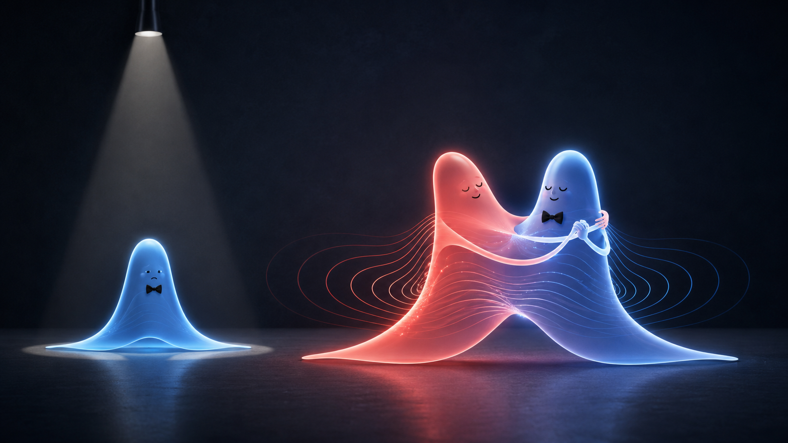



## What this lecture is based on

:::: {.lecture-source-layout}

::: {.lecture-source-text}

- **V. A. Allahverdyan and D. V. Naumov**, notes on attraction and
  repulsion in scalar QED *(paper to be published)*.
- **D. V. Naumov**, *Quantum Field Theory for Experimentalists and Not Only*. <https://neutrinohit.github.io/books.html>
- Slides:
  <https://neutrinohit.github.io/qft-lectures/en/slides/ScalarQEDAttractionRepulsion.html>


:::

::: {.lecture-source-cover}
{fig-alt="Cover of Quantum Field Theory for Experimentalists and Not Only"}
:::

::::

# You always wanted to know but never dared to ask!

## In QFT, where exactly do attraction and repulsion live?

::: incremental
- Look for a Newtonian force!
  - There are no Newtonian forces in QFT
- For like charges one expects repulsion, for opposite charges attraction. Look for the sign of charges in the cross-section!
  - But cross-sections $\sigma \propto |A|^2>0$ do not depend on the sign of charges
- Look at the Feynman diagram - electrons repel because they exchange a photon like a ball!
  - Really? Let us examine this 'explanation'
:::

## How does QFT describe attraction and repulsion?

```{=html}
<video class="slide-video"
style="--media-width: 90%; --media-max-height: 772px;"
data-autoplay loop muted playsinline controls>
  <source src="media/scalar-qed-attraction-repulsion/ElectronElectronScattering.mp4" type="video/mp4">
</video>
```

## Repulsion picture: looks reasonable?
{.slide-image-center .nostretch width=80% fig-align="center" fig-alt="A qualitative picture for the repulsion"}

# How to explain the attraction?

## Attraction picture: looks reasonable too?
{.slide-image-center .nostretch width=80% fig-align="center" fig-alt="A qualitative picture for the attraction"}

## Summary so far

::: {.incremental}
- QED does not switch from a "ball-like photon" for like charges to a "boomerang-like photon" for opposite charges.
- The boomerang story is not just incomplete; it uses the wrong mechanism.
- A real boomerang turns because it interacts with air. Its two wings move differently, aerodynamic forces tilt it, and angular momentum redirects the motion.
- In empty space, with no air and no gravity, a "photon boomerang" would not curve back toward the second charge.
- An analogy may be crude, but it must still work in principle. This one does not.
:::

# Key idea: interference between the initial and interaction-generated waves







# Do you miss equations?

# Scalar Electrodynamics

## The Lagrangian

::: incremental

- Let us consider a theory with complex field $\varphi$ and electromagnetic potential $A^\mu$.
- The Lagrangian for free fields reads
$$
\mathcal L
=
(\partial_\mu \varphi)^*(\partial^\mu \varphi)
-m^2\varphi^*\varphi
-\frac{1}{4}F_{\mu\nu}F^{\mu\nu},
$$
- **Gauge invariance principle** adds the interaction between fields with:
$$
\partial_\mu \to D_\mu=\partial_\mu+iqA_\mu.
$$
- Then,
$$
\boxed{
\mathcal L
=
(D_\mu \varphi)^*(D^\mu \varphi)
-m^2\varphi^*\varphi
-\frac{1}{4}F_{\mu\nu}F^{\mu\nu}.}
$$
:::

::: {.marginnote .absolute .note-right top=110 left=1320 width=280}
<span class="note-title">Electromagnetic tensor</span>
$$
F_{\mu\nu}=\partial_\mu A_\nu-\partial_\nu A_\mu.
$$

:::

## Equations of Motion
::: incremental

- In Lorenz gauge,
$$
\partial_\mu A^\mu=0,
$$
- the equations become
$$
\begin{aligned}
(\partial^2+m^2)\varphi
&=
q^2A^2\varphi
-2iqA_\mu\partial^\mu\varphi,
\\
\partial^2 A^\mu
&=
iq(\varphi^*\partial^\mu\varphi-\varphi\partial^\mu\varphi^*)
-2q^2A^\mu|\varphi|^2 .
\end{aligned}
$$
- These are **non-linear** equations.
- The first equation says that the electromagnetic potential shifts the scalar
wave.
- The second says that the scalar wave itself sources the electromagnetic
field.
- We are going to solve the equations of motion to see how attraction and repulsion appear.

:::

::: {.marginnote .absolute .note-right top=110 left=1220 width=360}
<span class="note-title">Euler-Lagrange equations</span>
$$
\frac{\partial \mathcal L}{\partial \varphi} = \partial_\mu\frac{\partial\mathcal L}{\partial\partial_\mu \varphi}
$$
:::

## Weak-Coupling
::: incremental

- Use the perturbative expansion
$$
\varphi
=
\varphi^{(0)}
+q^2\varphi^{(2)}
+O(q^4),
\qquad
A_\mu
=
qA_\mu^{(1)}
+q^3A_\mu^{(3)}
+O(q^5).
$$

- Then
$$
(\partial^2+m^2)\varphi^{(0)}=0,
\qquad
\partial^2 A_\mu^{(1)}=J_\mu,
$$
with
$$
J_\mu
=
i\left(
\varphi^{(0)*}\partial_\mu\varphi^{(0)}
-\varphi^{(0)}\partial_\mu\varphi^{(0)*}
\right).
$$

:::

## What We Need From the Expansion

::: {.incremental}
- First: a free packet $\varphi^{(0)}$.
- Second: the electromagnetic field $A_\mu^{(1)}$ generated by that packet.
- Third: the $O(q^2)$ phase correction to the packet $\varphi^{(0)}$.
- Finally: two packets and their interaction.
:::

::: {.marginnote .absolute .note-right top=110 left=1320 width=280}
<span class="note-title">The plan</span>
1. $\varphi^{(0)}$.

2. $J^\mu$.

3. $A^{(1)}_\mu$.

4. $\varphi^{(2)}$

5. Enjoy interaction!
:::

# One Gaussian Packet
## Zero order for $\varphi$ and first order for $A_\mu$

:::: {.panel-tabset}

### Narrow momentum packet

- In the packet rest frame, take
$$
\widetilde\psi(\mathbf k)
=
(2\pi)^{3/4}\sigma_p^{-3/2}
\exp\!\left[-\frac{\mathbf k^2}{4\sigma_p^2}\right],
\qquad
\sigma_p\ll m .
$$
- The exact free solution is
$$
\varphi_{\rm rest}^{(0)}(x)
=
\int\frac{d^3k}{(2\pi)^3}
\widetilde\psi(\mathbf k)
e^{i\mathbf k\cdot\mathbf x-iE_{\mathbf k}t},
\qquad
E_{\mathbf k}=\sqrt{m^2+\mathbf k^2}.
$$

### Coordinate-space form

Using

$$
E_{\mathbf k}
=m+\frac{\mathbf k^2}{2m}
+O\!\left(\frac{\sigma_p^4}{m^3}\right),
$$

the packet is approximately

$$
\varphi_{\rm rest}^{(0)}(x)
\approx
\left(\frac{2\sigma_p^2}{\pi}\right)^{3/4}
\frac{1}{(1+i\tau)^{3/2}}
\exp\!\left[-\frac{\sigma_p^2\mathbf x^2}{1+i\tau}\right]
e^{-imt},
$$

$$
\tau=\frac{2\sigma_p^2t}{m},
\qquad
t_{\rm disp}=\frac{m}{2\sigma_p^2}.
$$

### Density and current

Define

$$
s_p(t)=\frac{\sigma_p}{\sqrt{1+\tau^2}},
\qquad
\sigma_x(t)=\frac{1}{2s_p(t)}.
$$

Then

$$
n(t,\mathbf x)=|\varphi_{\rm rest}^{(0)}(x)|^2
=
\left(\frac{2s_p^2(t)}{\pi}\right)^{3/2}
\exp[-2s_p^2(t)\mathbf x^2].
$$

To leading order in $\sigma_p/m$,

$$
J^\mu(t,\mathbf x)
\approx
\left(
2mn(t,\mathbf x),
\;
4\frac{\sigma_p^2\tau}{1+\tau^2}\mathbf x\,n(t,\mathbf x)
\right).
$$

### Almost electrostatic

The spatial current is suppressed by $\sigma_p/m$, so

$$
A_{\rm rest}^{(1)i}=O\!\left(\frac{\sigma_p}{m}\right),
\qquad
-\Delta A_{\rm rest}^{(1)0}(t,\mathbf x)\approx J^0(t,\mathbf x).
$$

Thus

$$
A_{\rm rest}^{(1)0}(t,\mathbf x)
\approx
2m\int d^3y\,
\frac{n(t,\mathbf y)}{4\pi|\mathbf x-\mathbf y|}.
$$

A finite packet replaces the point Coulomb source by a smooth charge cloud.

### Smoothed Coulomb kernel

For a Gaussian packet,

$$
\boxed{
A_{\rm rest}^{(1)0}(t,r)
\approx
\frac{m}{2\pi r}
\operatorname{erf}\!\left(\sqrt{2}\,s_p(t)r\right)
}
$$

or

$$
A_{\rm rest}^{(1)0}(t,r)
\approx
2mV_{s_p(t)}(r),
\qquad
V_s(r)=
\frac{1}{4\pi r}
\operatorname{erf}\!\left(\sqrt{2}sr\right).
$$

At large distance this is Coulomb. At the center it is finite.

### Profile of the kernel

::::: {.columns}

::: {.column width="60%"}
{.slide-image-center .nostretch width=90% fig-align="center" fig-alt="Gaussian self-potential profile compared with the Coulomb limit"}
:::

::: {.column width="40%"}
Dimensionless profile $4\pi V_s(r)/(\sqrt{2}s)$ as a function of
$\rho=\sqrt{2}sr$. The dashed curve is the point Coulomb limit $1/\rho$.
:::

::::

### Laboratory system

For a moving packet with mean four-momentum $p_0^\mu=(E_0,\mathbf p_0)$,

$$
\mathbf v_0=\frac{\mathbf p_0}{E_0},
\qquad
\gamma_0=\frac{E_0}{m},
\qquad
\mathbf R=\mathbf x-\mathbf v_0t,
$$

$$
t_*=\gamma_0(t-\mathbf v_0\cdot\mathbf x)=\frac{p_0\cdot x}{m},
$$

$$
r_*^2
=
|\mathbf R|^2+
(\gamma_0^2-1)(\hat{\mathbf v}_0\cdot\mathbf R)^2.
$$

Then

$$
\boxed{
A^{(1)\mu}(x)
\approx
2p_0^\mu V_{s_p(t_*)}(r_*)
}.
$$

### Animation

```{=html}
<video class="slide-video media-height-lg" data-autoplay loop muted playsinline controls>
  <source src="media/scalar-qed-attraction-repulsion/single.mp4" type="video/mp4">
</video>
```

::::

## Second order for $\varphi$

:::: {.panel-tabset}


### Self-Phase

The $O(q^2)$ scalar correction obeys

$$
(\partial^2+m^2)\varphi^{(2)}
=
-2iA_\mu^{(1)}\partial^\mu\varphi^{(0)}.
$$

For a narrow packet,

$$
\varphi^{(2)}(x)
=
-2im\,\mathcal I_{\sigma_p}(t_*,r_*)\,
\varphi^{(0)}(x),
$$

where

$$
\mathcal I_{\sigma_p}(t,r)
=
\int_0^t d\lambda\,V_{s_p(\lambda)}(r).
$$

### Phase Interpretation

To this order,

$$
\varphi(x)
\approx
\varphi^{(0)}(x)
\exp\!\left[-2iq^2m\,\mathcal I_{\sigma_p}(t_*,r_*)\right].
$$

In the packet rest frame this is

$$
\varphi_{\rm rest}(x)
\approx
\varphi_{\rm rest}^{(0)}(x)
\exp\!\left[-i\int_0^t d\lambda\,U_{\rm eff}(\lambda,r)\right],
$$

$$
\boxed{
U_{\rm eff}(t,r)
=
2q^2m\,V_{s_p(t)}(r)
}.
$$

::: {.takeaway}
At this level, the self-interaction is primarily a local phase shift.
:::

::::

## A lonely packet has no opinion

:::: {.columns}

::: {.column width="55%"}

::::: incremental

- For one packet, the correction knows only
$$
q^2 .
$$

- So the packet can acquire a self-phase, but it cannot decide whether the world is attractive or repulsive.
$$
q \to -q
\qquad\Rightarrow\qquad
q^2 \to q^2 .
$$
- To ask about attraction or repulsion, we need a second packet.

:::::

:::

::: {.column width="45%"}

{.fragment .image-uncover .from-left .slide-image-center .nostretch style="--uncover-amount: 36%; --uncover-width: 92%; --uncover-max-height: 430px;" fig-align="center" fig-alt="A single lonely Gaussian packet first, then the full picture with two interacting packets"}

:::

::::


# Two Packets

## Eikonal form and 2D animations

:::: {.panel-tabset}

### What changes?

- We now take **two well separated Gaussian packets**.
- Each packet is the same object we have just constructed: a free wave packet
  plus the smooth electromagnetic field it sources.
- The only new label is the sign of its charge.

$$
Q_a=\pm |Q_a|,\qquad a=1,2.
$$

### First approximation

- At first order, the electromagnetic fields simply add:

$$
A^\mu \simeq A_1^\mu+A_2^\mu.
$$

- This is not yet a Newtonian force.
- It is the background in which each wave accumulates phase.

### Where the physics sits

For packet $a$,

$$
\Phi_a
\simeq
\Phi_a^{(0)}
\exp[-iq^2\Theta_a].
$$

::: {.takeaway}
In the first non-trivial approximation, attraction and repulsion live in the
phase of the wave packet.
:::

### How a phase bends a packet

- A position-dependent phase changes the local momentum.
- The mutual part of the phase is the part created by the other packet.
- The center bends because the phase gradient is different on the two sides of
  the packet.

$$
\text{field}
\longrightarrow
\text{phase}
\longrightarrow
\text{phase gradient}
\longrightarrow
\text{deflected center}.
$$

### One sign decides

- The construction is the same for both cases.
- Changing one packet from particle to antiparticle changes the sign of
  $Q_1Q_2$.
- The phase gradient flips direction.

$$
Q_1Q_2>0 \Rightarrow \text{repulsion},
\qquad
Q_1Q_2<0 \Rightarrow \text{attraction}.
$$

### Repulsion

```{=html}
<video class="slide-video media-height-md" data-autoplay loop muted playsinline controls>
  <source src="media/scalar-qed-attraction-repulsion/pp.mp4" type="video/mp4">
</video>
```

::: {.media-caption}
Like charges: the same eikonal construction bends the packet centers apart.
:::

### Attraction

```{=html}
<video class="slide-video media-height-md" data-autoplay loop muted playsinline controls>
  <source src="media/scalar-qed-attraction-repulsion/pm.mp4" type="video/mp4">
</video>
```

::: {.media-caption}
Opposite charges: only the sign changes, so the phase gradient points the other way.
:::

::::

# Attraction and Repulsion in Quantum Field Theory. Once More in Pictures

## The chain of ideas

:::: {.panel-tabset .story-tabs}

### The question

:::: {.story-question-grid}

::: {}
```{=html}
<video class="slide-video media-height-sm" data-autoplay loop muted playsinline controls>
  <source src="media/scalar-qed-attraction-repulsion/ElectronElectronScattering.mp4" type="video/mp4">
</video>
```
:::

::: {}

:::

::::

::: {.media-caption}
The exchange picture is familiar. The question is sharper: where does the sign
of attraction or repulsion enter?
:::

### The false analogy

:::: {.story-picture-pair}
::: {}
{fig-alt="Qualitative boat picture for repulsion"}
:::

::: {}
{fig-alt="Qualitative boat picture for attraction"}
:::
::::

::: {.media-caption}
The analogy changes the mechanism between the two cases. Scalar QED does not.
:::

### The one-dimensional clue



### Scalar QED packets

:::: {.story-video-pair}
::: {}
```{=html}
<video class="slide-video media-height-sm" data-autoplay loop muted playsinline controls>
  <source src="media/scalar-qed-attraction-repulsion/pp.mp4" type="video/mp4">
</video>
```

::: {.media-caption}
Like charges: the centers bend apart.
:::
:::

::: {}
```{=html}
<video class="slide-video media-height-sm" data-autoplay loop muted playsinline controls>
  <source src="media/scalar-qed-attraction-repulsion/pm.mp4" type="video/mp4">
</video>
```

::: {.media-caption}
Opposite charges: the same construction bends them together.
:::
:::
::::

::::
